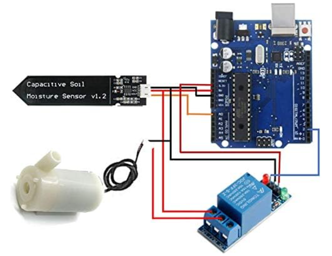

# Sistema de Riego Inteligente (Smart Watering System)

Este proyecto consiste en la creación de un sistema de riego automático utilizando Arduino, un sensor de humedad del suelo, una bomba de agua y un solenoide para controlar el flujo de agua. El sistema se diseñó con el propósito de regar una planta de manera automática, basándose en los niveles de humedad del suelo.

## Componentes Necesarios
- [Arduino Uno](https://www.amazon.es/dp/B008GRTSV6?psc=1&ref=ppx_yo2ov_dt_b_product_details).
- [Cable USB para Arduino](https://www.amazon.es/dp/B07DCX7454?psc=1&ref=ppx_yo2ov_dt_b_product_details).
- [Mini Breadboard 400 Pin con 4 Barras de Alimentación compatibles con Arduino](https://www.amazon.es/dp/B07CYW8V3Q?psc=1&ref=ppx_yo2ov_dt_b_product_details).
- [Cables puente Macho a Macho para Arduino Breadboard](https://www.amazon.es/dp/B00NBNIETC?psc=1&ref=ppx_yo2ov_dt_b_product_details).
- [Sistema de Riego Automático (Kit para Arduino), 1 Canal 5V Relé Módulo + Sensor de Humedad del Suelo + Mini Bomba de Agua DC 3V 5V + 1M Tubería de Agua de PVC](https://www.amazon.es/dp/B0814HXWVV?psc=1&ref=ppx_yo2ov_dt_b_product_details).

## Software Necesario
- [Arduino IDE](https://downloads.arduino.cc/arduino-ide/arduino-ide_2.2.1_Windows_64bit.exe?_gl=1*tr9fy2*_ga*OTQ1OTU5NDE1LjE2OTk2ODk5MDA.*_ga_NEXN8H46L5*MTY5OTY4OTkwMC4xLjEuMTY5OTY5MDAwNi4wLjAuMA..)

## Esquema de Conexión
A continuación se muestra el esquema de conexiones entre componentes. 

> ⚠️ **Asegúrate de seguir las conexiones correctamente para garantizar el funcionamiento correcto del sistema.**

## Configuración del Código
El código necesario para programar Arduino se encuentra en el archivo `code.ino`. Antes de cargar el código en tu placa Arduino, asegúrate de tener instalado el entorno de desarrollo Arduino IDE.

## Uso
1. Conecta todos los componentes según el esquema proporcionado.
2. Abre el archivo `codigo.ino` en el Arduino IDE y carga el código en tu placa.
3. Alimenta el sistema y observa cómo la planta se riega automáticamente cuando el suelo alcanza niveles de humedad bajos.

## Contribuciones
Este proyecto es de código abierto, y las contribuciones son bienvenidas. Si encuentras mejoras o deseas agregar nuevas características, ¡no dudes en hacer un fork y enviar un pull request!
